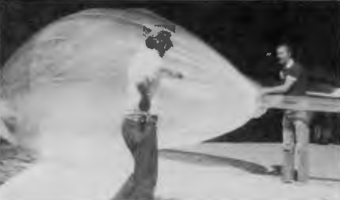

  

# STRATOSONDE
## Ultra-Lightweight Atmospheric Science Platform

A <15g solar-powered radiosonde for persistent stratospheric measurements.  
Validating long-duration balloon flight through open hardware and citizen science.

**Current Phase: Platform Validation & Thermal Model Testing**

---

## The Platform

**Stratosonde is an ultra-lightweight radiosonde designed for multi-day stratospheric flights.**

Traditional weather radiosondes provide 1-2 hours of atmospheric data before descent. Stratosonde aims to extend this to days or weeks by:

- **Minimizing weight** (<15g total) to float on inexpensive party balloons
- **Harvesting solar energy** to sustain operations through multiple diurnal cycles
- **Operating autonomously** with intelligent power management and region detection
- **Transmitting via LoRaWAN** to ground networks and future satellite connectivity

### System Specifications

| Component | Specification |
|-----------|---------------|
| **Total Weight** | <15 grams |
| **Target Altitude** | 12-18 km (40,000-60,000 ft) |
| **Mission Duration** | Multi-day validation → weeks/months goal |
| **Operating Temp** | -50°C to +60°C |
| **Power Source** | Solar + LTO battery |
| **Communication** | LoRaWAN (terrestrial + LEO satellite) |
| **Sensors** | Temperature, Pressure, Humidity, GPS |

---

## First Mission - Platform Validation

**Our initial flights focus on proving the technology, not proving science.**

### Mission Objectives

✓ **Platform Survivability** - Demonstrate multi-day operation in stratospheric conditions  
✓ **Thermal Model Validation** - Verify temperature predictions across diurnal cycles  
✓ **Power Budget Accuracy** - Validate solar harvesting and energy consumption models  
✓ **Trajectory Modeling** - Compare predicted vs. actual flight paths and altitude stability  
✓ **Autonomous Operation** - Test LoRaWAN region detection and communication reliability  

### Why This Matters

Before collecting meaningful atmospheric data, we must validate:
- Our thermal models accurately predict device temperatures through day/night cycles
- Solar energy harvesting sustains operation at extreme cold temperatures
- The platform maintains stable altitude for extended periods
- Data collection and transmission systems function reliably

**This validation phase establishes the foundation for future scientific missions.**

### Success Criteria

- [ ] Platform survives >24 hours at altitude
- [ ] Temperature predictions within ±5°C of measured values
- [ ] Power system sustains operation through full diurnal cycle
- [ ] GPS trajectory matches atmospheric model predictions
- [ ] LoRaWAN data successfully received from altitude

---

## Technology & Innovation

### Solar-Powered Stratospheric Operation

Operating at -50°C with minimal solar input presents unique challenges:
- **Energy Harvesting**: BQ25570 boost converter optimized for low-light, cold conditions
- **Battery Chemistry**: LTO cells maintain capacity at extreme temperatures
- **Power Management**: Adaptive duty cycling based on battery state and solar availability
- **Thermal Modeling**: Predictive algorithms for temperature-dependent system behavior

### Autonomous Global Operation

**H3 Geospatial Region Detection** - Embedded H3 hexagonal indexing automatically detects LoRaWAN regulatory regions as the balloon drifts globally, switching frequency plans without ground control.

**Opportunistic Communication** - Transmits telemetry when within range of terrestrial LoRaWAN gateways; designed for future LEO satellite connectivity.

### Flight Dynamics Modeling

Our atmospheric prediction tools model:
- Ascent physics with varying atmospheric density
- Float altitude based on balloon elasticity and gas laws  
- Thermal cycles affecting buoyancy and altitude stability
- Trajectory prediction using NOAA GFS wind data

---

## Open Science & Participation

### How to Get Involved

**📊 For Scientists**
- Access flight data and telemetry
- Validate atmospheric models
- Propose measurement objectives
- Collaborate on analysis

**🔧 For Hardware Developers**
- Review PCB designs
- Suggest component optimizations
- Test prototypes
- Contribute CAD files

**💻 For Software Engineers**
- Improve firmware efficiency
- Enhance prediction algorithms
- Build analysis tools
- Develop visualization interfaces

**🎓 For Educators**
- Use calculators in physics curriculum
- Track live flights with students
- Adapt designs for classroom projects
- Contribute educational materials

**🎈 For Balloon Enthusiasts**
- Test flight predictions
- Share launch experiences
- Monitor telemetry
- Document results

### Community Resources

- **Discord**: [discord.gg/CdqQqW7n](https://discord.gg/CdqQqW7n) - Real-time discussion
- **GitHub**: [@stratosonde](https://github.com/stratosonde) - All code and hardware designs
- **Documentation**: [docs.stratosonde.org](https://docs.stratosonde.org) - Technical details
- **Email**: info@stratosonde.org - Direct contact

---

## Interactive Tools

We've built open-source calculators and visualizations to support platform design:

### [Balloon Float Calculator](https://stratosonde.github.io/.github/profile/float1g_visual.html)
Physics-based altitude prediction with step-by-step calculations. Model superpressure balloon behavior, gas expansion, differential pressure, and safety margins.

### [Power Budget Calculator](https://stratosonde.github.io/.github/profile/solar_radiosonde_power_budget.html)
Comprehensive energy analysis with temperature derating, duty cycle modeling, and multi-day mission simulation. Optimize solar panel size and battery capacity.

### [LoRaWAN Region Viewer](https://stratosonde.github.io/.github/profile/cesium-lorawan-viewer.html)
Interactive 3D globe showing worldwide LoRaWAN regulatory regions. Visualize the H3 hexagonal grid used for autonomous region detection.

---

## Technical Foundation

### Hardware
- **MCU**: STM32WLE5JC (Cortex-M4 @ 48MHz, integrated LoRa radio)
- **GNSS**: Quectel L96 or u-blox MAX-M10S
- **Sensors**: Sensirion SHT31 (temp/humidity), TE MS5607 (pressure/altitude)
- **Power**: Texas Instruments BQ25570 energy harvester + 2S LTO batteries
- **Solar**: Custom PCB-integrated panels optimized for low-angle, diffuse light

### Firmware
- Real-time power management and thermal modeling
- H3Lite geospatial indexing for autonomous LoRaWAN region detection  
- Flash-based data logging with wear leveling
- Adaptive transmission scheduling based on battery state
- GNSS power optimization with predictive duty cycling

---

## Heritage & Community

**Stratosonde stands on the shoulders of the amateur radio and picoballoon communities.**

For decades, ham radio operators pioneered high-altitude balloon tracking and telemetry. In recent years, the picoballoon community achieved globe-circumnavigating flights with <100g payloads on party balloons - proving ultra-lightweight stratospheric platforms work.

Stratosonde extends this proven foundation by adding:
- Autonomous LoRaWAN region detection via H3 geospatial indexing
- Scientific methodology for reproducible atmospheric measurements
- Integration with emerging LEO satellite LoRaWAN networks

We contribute back through open-source hardware designs, detailed documentation, and participation in communities like [picoballoon groups.io](https://groups.io/g/picoballoon) and [UKHAS](https://ukhas.org.uk).

**Historical Note:** The name *Stratosonde* honors Environment Canada's 1986 atmospheric research program. [Read the Zephyr 1986 Environment Canada publication →](images/noel1986f.pdf)

**Community Resources:**
- [Picoballoon Group](https://groups.io/g/picoballoon) - Flight coordination & community tracking
- [UKHAS](https://ukhas.org.uk) - High altitude balloon documentation & tools
- [Amateur Radio Networks](https://aprs.fi) - APRS tracking infrastructure

---

## Repositories

- **[firmware](https://github.com/stratosonde/firmware)** - Core firmware for the radiosonde device
- **[ground](https://github.com/stratosonde/ground)** - Ground station software and tracking
- **[hardware](https://github.com/stratosonde/hardware)** - PCB designs, schematics, and component information
- **[docs](https://github.com/stratosonde/docs)** - Technical documentation site
- **[h3lite](https://github.com/stratosonde/h3lite)** - Embedded H3 geospatial indexing for automatic LoRaWAN region detection
- **[.github](https://github.com/stratosonde/.github)** - Organization profile and landing page

---

**Open hardware for atmospheric science**
